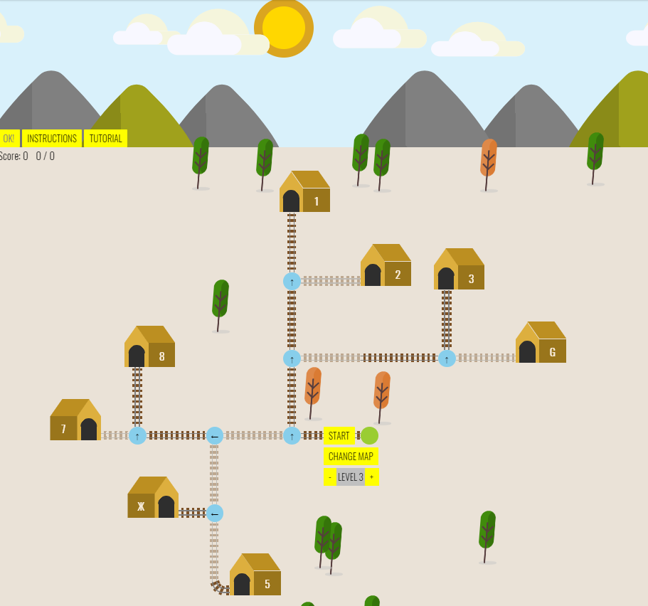

# Trains
Simple game with HTML, CSS, JS.
Original was made for an FBLA competition tryout. Sadly didn't make it...oh well.

Pretty self explanatory.

## Game instructions (also can be found in game window):
Trains spawn from the bright green circle. Your goal is to match station and train numbers, guide the trains to the right stations by changing the tracks along their way. Clicking the blue circles at the intersections changes tracks. ...It gets harder and there are different levels!

